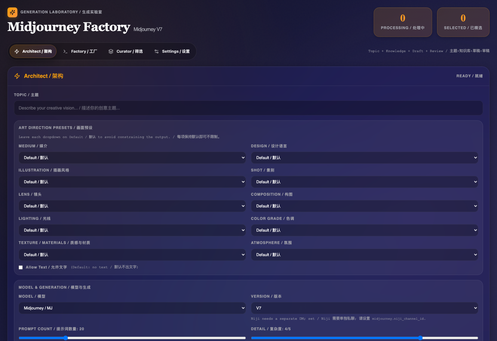
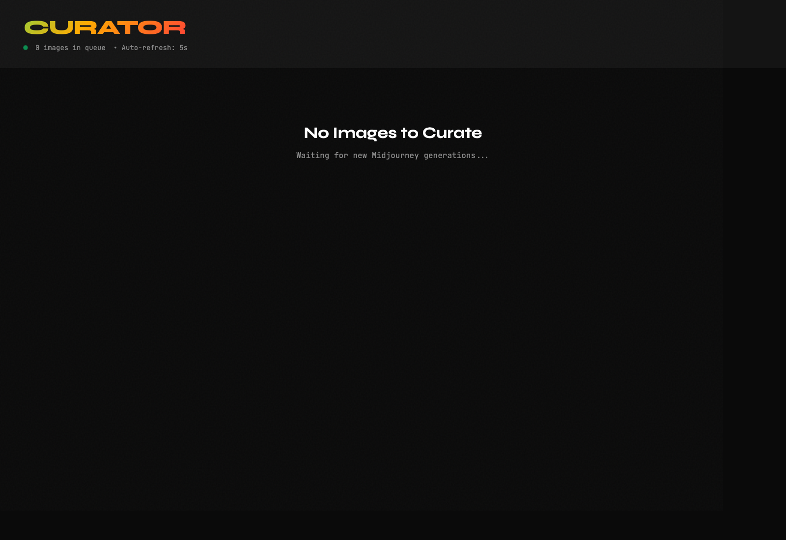

# Midjourney Factory

[](./LICENSE)


Midjourney Factory is a local-first creative pipeline for Midjourney / Niji:
generate prompts with an LLM, review them in a control panel, send batches to
Discord, and curate the resulting images locally.

Midjourney Factory 是一个面向 Midjourney / Niji 的本地化创作流水线：
先用 LLM 生成 prompt 草稿，再在控制台审核批准，随后批量投递到 Discord，
最后把生成结果回收到本地进行筛选和沉淀。

It is built for creators and builders who want a reproducible,
human-in-the-loop workflow instead of scattered prompt files and manual Discord
operations.

它适合希望把创作流程系统化的人：不再依赖零散 prompt 文本和手工操作，
而是把生成、审批、执行、筛选放到同一条可复用流水线上。

Quick links:

- [Highlights](#highlights--项目亮点)
- [Screenshots](#screenshots--界面截图)
- [Demo](#demo--演示方式)
- [Quick Start](#quick-start--快速开始)
- [Configuration](#configuration)

## Highlights | 项目亮点

- Local-first and self-hosted by default
- Human-in-the-loop workflow instead of blind full automation
- Modular architecture: `Architect -> Commander -> Factory -> Curator`
- LLM prompt drafting plus manual approval before execution
- Discord automation with local download and curation flow
- Test coverage across the main modules

## Status | 当前状态

- Active early-stage open-source project
- Intended for self-hosted creative workflows
- Suitable for local experimentation, tooling, and contributor iteration
- Not affiliated with Midjourney, Discord, or OpenAI

## Screenshots | 界面截图

| Commander Dashboard | Curator |
| --- | --- |
|  |  |

- `Commander` combines prompt generation, review, queueing, factory control, and settings in one dashboard.
- `Curator` keeps the final step lightweight: quickly keep or discard generated images locally.

## Demo | 演示方式

There is no hosted web demo by design. Midjourney Factory is intended to run
locally because it deals with local prompts, credentials, browser state, and
creative output directories.

If you want the fastest hands-on demo, use this flow:

1. Copy `.env.example` to `.env`
2. Run `./start.sh`
3. Open the Commander dashboard on the printed local URL
4. Generate drafts in `Architect`
5. Review and approve a batch into `output/prompts/`
6. Start `Factory` to dispatch prompts to Discord
7. Open `Curator` and keep the best images locally

如果你想快速体验整个流程，最简单的本地演示顺序就是：

1. 复制 `.env.example` 为 `.env`
2. 运行 `./start.sh`
3. 打开日志里输出的 Commander 本地地址
4. 在 `Architect` 里生成草稿
5. 审核并批准到 `output/prompts/`
6. 启动 `Factory` 投递到 Discord
7. 在 `Curator` 中筛选并保留结果图

## Open Source Basics | 开源信息

- License: [MIT](./LICENSE)
- Contributing: [CONTRIBUTING.md](./CONTRIBUTING.md)
- Code of conduct: [CODE_OF_CONDUCT.md](./CODE_OF_CONDUCT.md)
- Security reporting: [SECURITY.md](./SECURITY.md)

## Workflow | 工作流

```text
Architect
    |
    v
output/prompts_drafts/
    |
    v
Commander (审核 / 编辑 / 批准)
    |
    v
output/prompts/
    |
    v
Factory
    |
    v
output/incoming/
    |
    v
Curator
    |
    v
output/best/
```

How it works:

- `Architect` generates structured prompt draft JSON files.
- `Commander` reviews, edits, annotates, and approves prompt batches.
- `Factory` watches `output/prompts/`, sends `/imagine` jobs to Discord, and
  downloads generated images into `output/incoming/`.
- `Curator` helps you keep or discard images and move selected outputs into
  `output/best/`.

工作方式：

- `Architect` 负责生成 prompt JSON 草稿。
- `Commander` 负责审核、批注、参数调整、批准入列。
- `Factory` 监听 `output/prompts/`，向 Discord 发送 `/imagine`，并把生成结果下载到 `output/incoming/`。
- `Curator` 负责对 `output/incoming/` 中的图做 keep/discard，保留下来的图片移动到 `output/best/`。

## Quick Start | 快速开始

### Prerequisites | 环境要求

- Python 3.9+
- Node.js 18+
- Chromium
- Discord 账号
- 可用的 Midjourney / Niji 私聊频道
- 一个可调用的 LLM API（OpenAI 兼容接口最稳妥）

说明：

- `start.sh` / `start.bat` 首次运行时会自动安装 Python/Node 依赖，并尝试安装 Playwright Chromium。
- 本项目默认是本地开发工作流，不包含鉴权、部署编排和生产级安全隔离。

```bash
cp .env.example .env
```

Fill in the credentials in `.env`:

- `LLM_PRIMARY_API_KEY`
- `LLM_PRIMARY_BASE_URL`
- `DISCORD_TOKEN`
- `MJ_CHANNEL_ID`
- `NIJI_CHANNEL_ID` (optional)

填写 `.env` 中的凭证：

- `LLM_PRIMARY_API_KEY`
- `LLM_PRIMARY_BASE_URL`
- `DISCORD_TOKEN`
- `MJ_CHANNEL_ID`
- `NIJI_CHANNEL_ID`（可选）

Then start the full workflow:

```bash
./start.sh
```

然后启动：

```bash
./start.sh
```

On Windows:

```bat
start.bat
```

首次启动后你会得到：

- Commander Dashboard：自动选择 `3001-3010` 中的一个空闲端口
- Curator：固定启动在 `http://localhost:3000`

首次真正跑 Factory 前，先完成 Discord 登录态保存：

```bash
cd modules/factory
npm run login:factory
npm run login:uploader
```

Recommended first end-to-end run:

1. Start `./start.sh`
2. Open Commander
3. Enter a topic in Architect and generate drafts
4. Review and approve drafts into `output/prompts/`
5. Start Factory
6. Wait for images to appear in `output/incoming/`
7. Curate and keep the best results in `output/best/`

推荐的第一次完整链路：

1. 启动 `./start.sh`
2. 打开 Commander
3. 在 Architect 页输入主题并生成草稿
4. 在 Commander 审核草稿并批准到 `output/prompts/`
5. 启动 Factory
6. 等待图片进入 `output/incoming/`
7. 在 Curator 中筛图，保留结果进入 `output/best/`

## macOS App Launcher

### Electron Desktop App

如果你希望把项目打成一个真正的桌面窗口应用，而不是打开系统浏览器，使用 Electron 方案：

```bash
npm install
npm run desktop:dist:mac
```

产物默认在：

```text
dist/mac-arm64/Midjourney Factory.app
```

如果要指定图标：

```bash
APP_ICON_PATH=/absolute/path/to/icon.png npm run desktop:dist:mac
```

也可以单独先生成 `.icns`：

```bash
APP_ICON_PATH=/absolute/path/to/icon.png npm run desktop:icon
```

这个版本的特点：

- 打开的是 Electron 窗口，不会自动弹出系统浏览器。
- 首次运行会把 `.env`、`settings.yaml`、knowledge、output、登录态目录初始化到用户本地数据目录。
- 最终用户可以在 Commander 的 `Settings / 设置` 页填写：
  - LLM provider / model / temperature
  - API key / base URL
  - Discord token / channel id
  - Factory 浏览器路径和超时
- `Settings / 设置` 页还提供：
  - `Login Factory`
  - `Login Uploader`
  - `Install Chromium`

分享给别的 Mac 时请注意：

- 这是 unsigned app。第一次打开通常需要在 macOS 的安全提示里手动允许。
- 目标 Mac 仍然需要 `python3`，因为 `Architect` 会在本机创建自己的 Python venv。
- Playwright Chromium 可以让收件人在 `Settings / 设置` 页点击 `Install Chromium` 安装。
- 图标支持 `.icns`、`.png`、`.jpg`、`.jpeg`、`.tiff`。

### Lightweight Launcher

如果你想把当前仓库封装成一个可双击启动的 macOS `.app`，可以直接生成一个 launcher app：

```bash
chmod +x scripts/build-macos-app.sh scripts/start-detached.sh
./scripts/build-macos-app.sh
```

如果你想指定图标：

```bash
./scripts/build-macos-app.sh output/app /absolute/path/to/icon.png
```

或：

```bash
APP_ICON_PATH=/absolute/path/to/icon.png ./scripts/build-macos-app.sh
```

默认输出：

```text
output/app/Midjourney Factory.app
```

说明：

- 这是一个 launcher-style app，不是把 Node/Python/Playwright 完全静态打进单文件发行包。
- `.app` 双击后会在后台调用仓库内的 `start.sh`，默认带 `NO_AUTO_OPEN=1`，不会自动弹出浏览器。
- 当前控制台仍然是 Web UI；如果你需要操作 Commander，需手动打开日志里显示的本地地址。
- 图标支持 `.icns`、`.png`、`.jpg`、`.jpeg`、`.tiff`。
- 传入普通图片时，脚本会自动转换为 `.icns` 并写入 app bundle。
- 日志写到 `output/logs/macos-launch.log`。
- 如果你移动了仓库目录，需要重新运行一次 `./scripts/build-macos-app.sh` 生成新的 app。

## Configuration

### `config/settings.yaml`

当前仓库的配置骨架如下：

```yaml
llm:
  primary:
    provider: "openai"
    base_url: ""
    api_key: ""
    model: "gemini-3-pro-high"
    temperature: 0.7

  fallback:
    provider: "openai"
    base_url: ""
    api_key: ""
    model: "claude-sonnet-4-5"
    temperature: 0.7

midjourney:
  discord_token: ""
  channel_id: ""
  niji_channel_id: ""

factory:
  discord_navigation_timeout_ms: 180000
  # browser_path: "/path/to/chrome-or-chromium"

# 兼容旧写法，Factory 也会读取顶层 browser_path
# browser_path: "/path/to/chrome-or-chromium"
```

字段说明：

- `llm.primary`：Architect 默认使用的主模型配置。
- `llm.fallback`：主模型报错或超时时自动切换的备用模型配置。
- `provider`：当前代码最适合接 OpenAI 兼容接口；如使用代理或网关，填对应 `base_url`。
- `model`：传给上游接口的模型名。
- `temperature`：Architect 生成 prompt 时的采样温度。
- `midjourney.discord_token`：Factory 的 Discord REST 回退下载与引用图上传会用到。
- `midjourney.channel_id`：Midjourney 私聊频道 ID。
- `midjourney.niji_channel_id`：Niji 私聊频道 ID，可选。
- `factory.discord_navigation_timeout_ms`：Discord 页面加载和控件等待超时。
- `factory.browser_path`：Windows 或自定义 Chromium 路径时建议显式填写。

### `.env` 变量

`.env` 由 Commander 在启动时加载，并传递给 Architect / Factory 子进程。环境变量优先级高于 `config/settings.yaml`。

| 变量名 | 必填 | 用途 |
| --- | --- | --- |
| `LLM_PRIMARY_API_KEY` | 是 | 主模型 API Key |
| `LLM_PRIMARY_BASE_URL` | 视提供方而定 | 主模型 OpenAI 兼容接口地址 |
| `LLM_FALLBACK_API_KEY` | 否 | 备用模型 API Key |
| `LLM_FALLBACK_BASE_URL` | 否 | 备用模型接口地址 |
| `DISCORD_TOKEN` | 强烈建议 | Discord REST 下载和上传引用图 |
| `MJ_CHANNEL_ID` | 是 | Midjourney 私聊频道 ID |
| `NIJI_CHANNEL_ID` | 否 | Niji 私聊频道 ID |
| `PORT` | 否 | Commander 端口；手动启动时生效，`start.sh` / `start.bat` 会覆盖为 `3001-3010` 中的空闲端口 |
| `NO_AUTO_OPEN` | 否 | 设为 `1` 后，Commander 启动时不自动打开浏览器 |
| `GDRIVE_ACCESS_TOKEN` | 否 | 旧版 Google Drive 上传接口使用 |
| `GDRIVE_FOLDER_ID` | 否 | 旧版 Google Drive 上传目标目录 |

注意：

- 直接执行 `python modules/architect/main.py ...` 时，不会自动读取 `.env`；这时要么先 `export` 变量，要么把值写进 `config/settings.yaml`。
- `DISCORD_TOKEN` 不是 Playwright 登录态的替代品。Factory 仍然需要 `login:factory` / `login:uploader` 生成的浏览器状态目录。

### LLM 双配置说明

本项目的 Architect 支持主备 LLM：

- 先调用 `llm.primary`
- 主模型失败时自动切换到 `llm.fallback`
- 主备可以指向不同供应商、不同模型、不同 `base_url`
- 如果你把 `provider` 设为 `opencode`，需要本机额外安装 `opencode` CLI，并在 YAML 中补充 `command_template`

推荐做法：

- `primary` 放高质量、大上下文模型
- `fallback` 放更稳或更便宜的模型
- `.env` 中只放密钥与地址，模型名和温度放 `settings.yaml`

## 模块文档

### Architect

职责：

- 读取 `modules/architect/knowledge/*.md|*.txt`
- 调用 LLM 生成 Midjourney / Niji prompt JSON
- 输出到 `output/prompts/`，或由 `--output-dir` 指定其它目录

CLI 用法：

```bash
modules/architect/.venv/bin/python modules/architect/main.py --help
```

```bash
modules/architect/.venv/bin/python modules/architect/main.py \
  "cyberpunk city at dawn" \
  --count 20 \
  --detail 4 \
  --requirements "editorial photography, clean geometry, no text" \
  --output-dir output/prompts_drafts
```

常用参数：

- `--count` / `-c`：生成数量，默认 `20`
- `--niji`：强制输出 Niji 7 风格参数
- `--detail 1-5`：prompt 复杂度
- `--requirements` / `-r`：额外艺术指导
- `--knowledge/--no-knowledge`：是否加载知识库
- `--output-dir`：覆盖输出目录

输出文件格式：

```json
{
  "topic": "cyberpunk city at dawn",
  "mode": "standard",
  "generated_at": "2026-03-10T12:00:00",
  "count": 20,
  "prompts": [
    {
      "prompt": "....",
      "parameters": {
        "ar": "16:9",
        "stylize": 300,
        "chaos": 15,
        "v": 7
      },
      "description": "..."
    }
  ]
}
```

### Commander

职责：

- 提供统一 Web 控制台
- 触发 Architect 生成草稿
- 审核并批准草稿到 `output/prompts/`
- 启停 Factory
- 启动并内嵌 Curator
- 管理知识库文件
- 上传参考图到 Discord 并回写 URL

启动方式：

```bash
./start.sh
```

或直接启动：

```bash
cd modules/commander
PORT=3001 npm run dev
```

页面模块：

- `Architect`：主题输入、知识库开关、草稿生成、草稿列表、审核批准
- `Factory`：参数统一加挂、预览、启动/停止
- `Curator`：内嵌筛图器

#### Commander API

| Method | Path | 作用 |
| --- | --- | --- |
| `POST` | `/api/architect/run` | 生成草稿；body: `topic`, `count`, `niji`, `requirements`, `detailLevel`, `useKnowledge` |
| `POST` | `/api/architect/import` | 直接导入多行 prompt 文本为草稿；body: `promptsText`, `niji` |
| `POST` | `/api/factory/toggle` | 启停 Factory；body: `action=start|stop` |
| `POST` | `/api/curator/start` | 启动 Curator |
| `POST` | `/api/curator/open` | 兼容旧路由，行为同上 |
| `GET` | `/api/stats` | 返回 `incoming` / `best` 文件数 |
| `GET` | `/api/prompts/drafts/latest` | 读取最新草稿 |
| `GET` | `/api/prompts/drafts/list` | 列出最近草稿 |
| `GET` | `/api/prompts/drafts/read?file=...` | 读取指定草稿 |
| `POST` | `/api/prompts/approve` | 审稿通过并写入 `output/prompts/` |
| `GET` | `/api/knowledge/list` | 列出知识库文件 |
| `GET` | `/api/knowledge/read?name=...` | 读取知识库文件 |
| `POST` | `/api/knowledge/upsert` | 新增或覆盖 `.md` / `.txt` 知识文件 |
| `POST` | `/api/knowledge/delete` | 删除知识文件 |
| `POST` | `/api/refs/upload-discord` | 把参考图上传到 Discord 并返回 CDN URL |
| `POST` | `/api/refs/upload` | 旧版 Google Drive 上传接口，需额外环境变量 |

Socket 事件：

- `log:architect`
- `log:factory`
- `log:curator`
- `status:factory`

### Factory

职责：

- 监听 `output/prompts/*.json`
- 自动判断是 Midjourney 还是 Niji 批次
- 用 Playwright 驱动 Discord `/imagine`
- 通过两级策略下载结果图到 `output/incoming/`
  - 首选：拦截 Discord CDN 响应
  - 回退：使用 `DISCORD_TOKEN` 调 Discord REST API
- 批次完成后把源文件重命名为 `_done.json`

CLI 用法：

```bash
cd modules/factory
npm run login:factory
```

```bash
cd modules/factory
npm run login:uploader
```

```bash
cd modules/factory
npm start
```

引用图上传脚本：

```bash
cd modules/factory
node upload_ref.js --file /absolute/path/reference.png --mode mj --timeout 300000
```

说明：

- `login:factory` 保存出图 Bot 的登录态到 `output/browser_state_factory/`
- `login:uploader` 保存引用图上传器的登录态到 `output/browser_state_uploader/`
- `npm start` 会持续轮询 `output/prompts/`，没有待处理批次时每 30 秒 sleep 一次

### Curator

职责：

- 展示 `output/incoming/` 中的图片
- `keep` 时移动到 `output/best/`
- `discard` 时从 `output/incoming/` 删除

启动方式：

```bash
cd modules/curator
npm start
```

默认地址：

- `http://localhost:3000`

#### Curator API

| Method | Path | 作用 |
| --- | --- | --- |
| `GET` | `/api/images` | 列出 `output/incoming/` 中的图片，按最新时间排序 |
| `POST` | `/api/action` | 对图片执行 `keep` 或 `discard`；body: `filename`, `action` |

#### 键盘快捷键

| 快捷键 | 动作 |
| --- | --- |
| `1` 或 `↑` | Keep |
| `2` 或 `↓` | Discard |
| `→` | Skip 下一张 |

目前仓库里只有 Curator 实现了键盘快捷键；Commander 和 Factory 没有全局快捷键。

## 目录结构

```text
midjourney-factory/
├── .env.example
├── config/
│   └── settings.yaml
├── modules/
│   ├── architect/
│   │   ├── knowledge/
│   │   ├── main.py
│   │   └── system_prompts.py
│   ├── commander/
│   │   ├── pages/
│   │   └── server.js
│   ├── factory/
│   │   ├── bot.js
│   │   ├── downloader.js
│   │   ├── login.js
│   │   └── upload_ref.js
│   └── curator/
│       ├── public/
│       └── server.js
├── output/
│   ├── prompts_drafts/
│   ├── prompts/
│   ├── incoming/
│   ├── best/
│   ├── browser_state_factory/
│   ├── browser_state_uploader/
│   └── refs_tmp/
├── start.sh
└── start.bat
```

重点目录说明：

- `output/prompts_drafts/`：Architect 输出、等待人工审核的草稿
- `output/prompts/`：批准后等待 Factory 执行的批次
- `output/incoming/`：Factory 下载回来的图片和 sidecar JSON
- `output/best/`：Curator 选中的最终图片
- `modules/architect/knowledge/`：Prompt 知识库，支持 `.md` 和 `.txt`
- `output/browser_state_*`：Discord 登录态缓存，包含敏感会话数据，不应提交

## Troubleshooting

### 1. `Please set the LLM API key`

原因：

- `LLM_PRIMARY_API_KEY` 没填
- 或你直接跑了 Architect CLI，但没有先导出环境变量

解决：

- 填写 `.env`
- 或把值写到 `config/settings.yaml`
- 直接跑 CLI 时先执行 `export $(cat .env | xargs)`，或者手动导出所需变量

### 2. Factory 报 `Discord session is not logged in`

原因：

- 没有保存 Playwright 浏览器状态

解决：

```bash
cd modules/factory
npm run login:factory
npm run login:uploader
```

### 3. Factory 启动了，但 `output/incoming/` 没有图片

排查顺序：

1. 检查 `MJ_CHANNEL_ID` / `NIJI_CHANNEL_ID` 是否正确
2. 检查 Discord 频道是否真的是你与 Midjourney / Niji 机器人的私聊
3. 检查 `DISCORD_TOKEN` 是否有效；没有 token 时，REST 回退下载不可用
4. 看 Commander / Factory 日志里是否出现下载失败
5. 检查 `output/incoming/` 是否生成了 sidecar `.json`

### 4. `No free port found in 3001-3010`

原因：

- 启动脚本只会在 `3001-3010` 范围内找 Commander 端口

解决：

- 关闭旧的 Commander / Next 进程
- 或手动启动 `modules/commander` 并显式设置 `PORT`

### 5. Curator 启动失败，提示端口 `3000` 被占用

原因：

- Curator 端口固定写死为 `3000`

解决：

- 释放 `3000`
- 或修改 `modules/curator/server.js` 里的 `PORT`

### 6. Playwright / Chromium 安装失败

解决：

```bash
cd modules/factory
npx playwright install chromium
```

如果是 Windows 且系统 Chrome 不在默认路径，补充：

```yaml
factory:
  browser_path: "C:\\Program Files\\Google\\Chrome\\Application\\chrome.exe"
```

### 7. 上传参考图失败

排查：

- 先执行 `npm run login:uploader`
- 确认 `MJ_CHANNEL_ID` 或 `NIJI_CHANNEL_ID` 已配置
- 大文件上传时适当调大 `--timeout`

## 开发指南

### 运行检查

当前仓库没有正式的自动化测试套件；更接近“手动 smoke test + 构建检查”的状态。建议至少跑下面这些检查：

```bash
modules/architect/.venv/bin/python modules/architect/main.py --help
```

```bash
cd modules/commander
npm run build
```

```bash
cd modules/curator
npm start
```

如果要验证完整工作流，最小手工回归路径是：

1. 启动 `./start.sh`
2. 生成一个草稿批次
3. 审核并批准到 `output/prompts/`
4. 启动 Factory 并确认有图片进入 `output/incoming/`
5. 用 Curator 执行一次 keep 和一次 discard

### 如何添加知识库文件

方式一：直接放文件

1. 在 `modules/architect/knowledge/` 下新增 `.md` 或 `.txt`
2. 一个文件只放一个主题，便于维护
3. 内容尽量写成稳定的视觉规则、风格关键词、反例和约束
4. 回到 Commander，刷新 Knowledge 列表，或重新运行 Architect

方式二：通过 Commander API

```bash
curl -X POST http://localhost:<COMMANDER_PORT>/api/knowledge/upsert \
  -H "Content-Type: application/json" \
  -d '{"name":"styles.md","content":"# Styles\ncinematic lighting\n..."}'
```

补充建议：

- 知识库文件名尽量语义化，例如 `styles.md`、`camera-language.md`
- 不要把一次性任务说明塞进知识库；一次性要求应走 `--requirements`
- 如果你新增的是供应商专用配置，优先改 `config/settings.yaml` 和 `.env.example`
